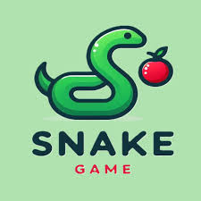

<h1 align="center"> 
  <strong>Snake</strong>
</h1>

<p align="center">
    
</p>

<div align="center">

  <a href="go version"></a>
  <a href="code coverage"></a>
  <a href="tests"></a>

</div>

#### **Description**

This is a simple snake game made in Golang using the ebitengine library.

#### **How to play**

- Use the arrow keys to move the snake.
- Eat the food to grow.
- Don't hit the walls or yourself.

#### **Play**

To play the game, run the following command:

```
go run cmp/snake/main.go
```