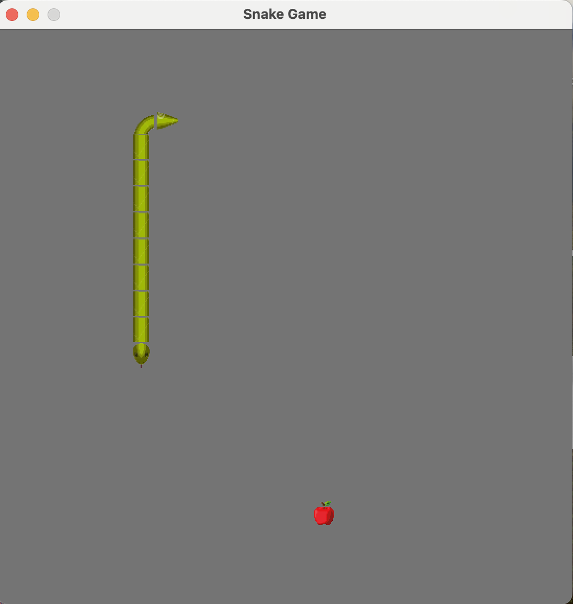

<h1 align="center"> 
  <strong>Snake</strong>
</h1>

<p align="center">
    
</p>

<div align="center">

  <a href="go version"></a>
  <a href="code coverage"></a>
  <a href="tests"></a>

</div>

#### **Description**

This is a simple snake game made in Golang using the ebitengine library.

#### **How to play**

- Use the arrow keys to move the snake.
- Eat the food to grow.
- Don't hit the walls or yourself.

#### **Play**

To play the game, run the following command:

```
go run cmp/snake/main.go
```

<p align="center">
    
</p>

#### **Acknowledgments**

There's a few things that I want to highlight:
- Sometimes the piece allocated to the snake's body is not really accurate considering the movement of the snake.
That probably has to do with the fact that the game clock and goroutine that handles the snake's movement are not really sync.
